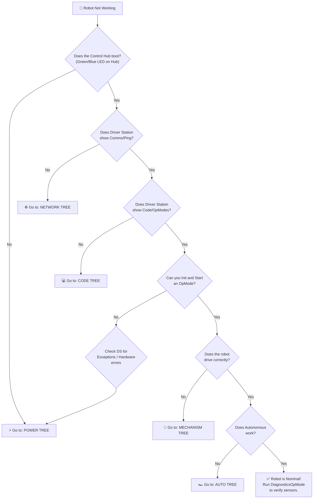
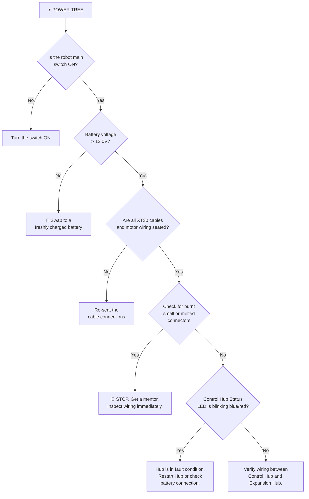
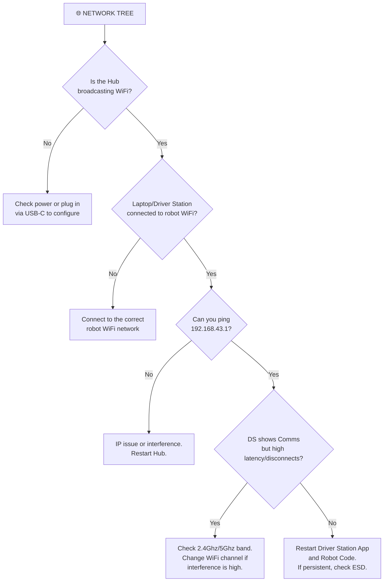
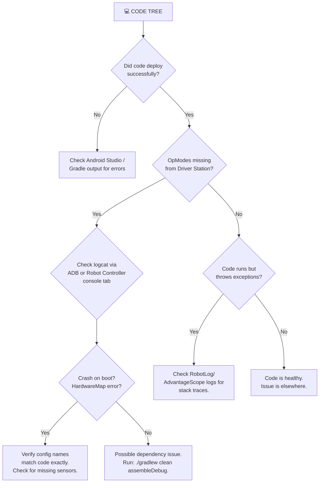

# 🔧 ARESLib Pit Debugging Flowchart

Use this guide when the robot is misbehaving in the pits. Start at the top and follow the arrows.

---

## Master Triage



---

## ⚡ Power Tree



---

## 🌐 Network Tree



---

## 💻 Code Tree



---

## 🦾 Mechanism Tree

```mermaid
flowchart TD
    M1["🦾 MECHANISM TREE"] --> M2{"Which mechanism<br/>is failing?"}

    M2 --> M_DRIVE["Drivetrain/Odometry"]
    M2 --> M_ELEV["Elevator/Slides"]
    M2 --> M_ARM["Arm/Pivot"]
    M2 --> M_INTAKE["Intake/Shooter"]

    M_DRIVE --> S1{"Motors spinning<br/>but not driving?"}
    S1 -- Yes --> S1A["Check wheel set screws<br/>or bevel gears."]
    S1 -- No --> S2{"One motor dead?"}
    S2 -- Yes --> S2A["Check motor cable and<br/>encoder wire seating."]
    S2 -- No --> S3{"Robot drives but<br/>odometry drifts?"]
    S3 -- Yes --> S3A["Check dead wheel springs.<br/>Verify IMU orientation.<br/>Check encoder wiring."]

    M_ELEV --> E1{"Slides not moving?"}
    E1 -- Yes --> E1A["Run diagnostics.<br/>Check spool string tension<br/>and motor connection."]
    E1 -- No --> E2{"Slides oscillating<br/>or overshooting?"}
    E2 -- Yes --> E2A["Reduce kP in<br/>constants. Verify kG<br/>(gravity FF) is tuned."]

    M_ARM --> A1{"Arm dropping<br/>under gravity?"}
    A1 -- Yes --> A1A["kG feedforward is wrong.<br/>Increase kG until arm<br/>holds position near 0 PID."]
    A1 -- No --> A2{"Arm hitting limits?"}
    A2 -- Yes --> A2A["Verify absolute encoder<br/>offset and soft limits."]

    M_INTAKE --> I1{"Motor spinning<br/>but no intake?"}
    I1 -- Yes --> I1A["Physical issue:<br/>Check rollers, belts,<br/>and compression."]
    I1 -- No --> I2{"Motor stalling?"}
    I2 -- Yes --> I2A["Check for physical jams.<br/>Check current limits."]
```

---

## 🏎️ Auto Tree

```mermaid
flowchart TD
    A1["🏎️ AUTO TREE"] --> A2{"Robot doesn't move<br/>in Auto?"}
    A2 -- Yes --> A3{"Is the starting pose<br/>set correctly?"}
    A3 -- No --> A3A["Verify pose reset is called<br/>at the start of auto."]
    A3 -- Yes --> A4{"PathPlanner/RoadRunner<br/>path loaded?"}
    A4 -- No --> A4A["Check that trajectory files<br/>are deployed to the hub."]
    A4 -- Yes --> A4B["Check telemetry to see<br/>if path is active."]

    A2 -- No --> A5{"Robot drives but<br/>is off-target?"}
    A5 -- Yes --> A6{"Consistently off<br/>in one direction?"}
    A6 -- Yes --> A6A["Odometry is drifting.<br/>Check dead wheel slipping.<br/>Check vision fusion offsets."]
    A6 -- No --> A6B["PID gains need tuning.<br/>Adjust Translation/Rotation kP."]

    A5 -- No --> A7{"Auto works but<br/>manipulators miss?"]
    A7 -- Yes --> A7A["Check timings and<br/>state machine delays.<br/>Verify sensor triggers."]
```

---

## Quick Reference Checklist

| Step | Action | Time |
|------|--------|------|
| 1 | Swap to a fresh battery (>12.5V) | 30s |
| 2 | Connect via USB/WiFi, verify Ping | 15s |
| 3 | Deploy code / Restart App | 45s |
| 4 | Init OpMode, check for exceptions | 10s |
| 5 | Verify physical connections (encoders, motors) | 30s |
| 6 | Check dead wheels and sensors | 15s |
| 7 | Run isolated system test | 30s |

> [!TIP]
> **Total pit turnaround target: under 3 minutes.** If you can't diagnose in 3 minutes, swap the battery and call the lead programmer or mentor.

> [!CAUTION]
> **NEVER enable the robot on blocks in the pit with mechanisms that could swing or extend.** Always have a spotter and ensure the e-stop (DS disable) is within arm's reach.
