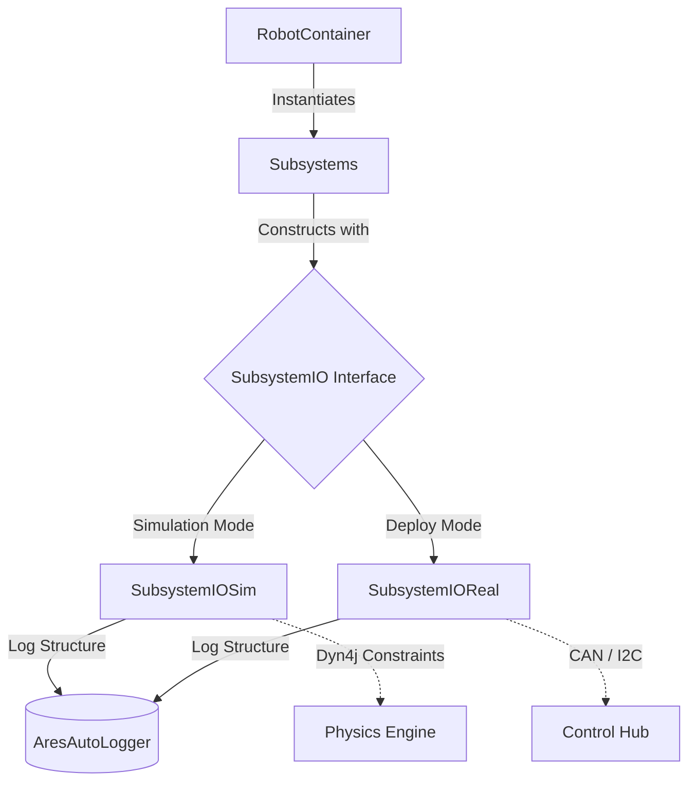

# ARESLib2 — Championship FTC Command Framework
[](https://github.com/thehomelessguy/ARESLib2/actions)

A professional-grade, Command-Based FTC robot framework with AdvantageKit-style telemetry, dyn4j physics simulation, and Pedro Pathing integration — built for Einstein.

## How to Use this Template

1. Click **"Use this template"** on GitHub to create your team's copy.
2. Clone your new repository onto your local machine.
3. Open in your IDE (VS Code or Android Studio).
4. Wait for Gradle sync to complete.

---

## Elite Features

| Feature | Description |
|:--------|:------------|
| **Physics Simulation** | Full dyn4j rigid-body contact physics with field boundaries, game piece interaction, and collision logging to AdvantageScope |
| **Dynamic Pathing** | Native Pedro Pathing wrappers with automated Bezier bounding-box obstacle avoidance |
| **Ghost Mode** | Serialized teleop JSON macros for auto-recording and flawless re-playback |
| **Shoot-on-the-Move** | Feedforward kinematic aim calculators with target leading |
| **State Machines** | Enum-based state machines with timed transitions, entry/exit actions, and timeout fallbacks |
| **Automated SysId** | Standardized quasistatic and dynamic WPILog routines to extract kS, kV, kA feedforwards |
| **Fault Management** | `AresFaultManager` natively tracks hardware alerts, broadcasts to AdvantageScope, triggers haptic/LED feedback |
| **Sensor Fusion** | Kalman-inspired vision + odometry blending with confidence gating and angular shortest-path interpolation |
| **LiDAR Fusion** | Array-based LiDAR raycasting with A* grid injection for real-time obstacle mapping |

---

## Project Structure

```text
src/main/java/org/areslib/          # Protected Framework Backend
├── command/                        # CommandScheduler, Command, SubsystemBase
├── core/                           # AresCommandOpMode, AresRobot, FieldConstants
│   ├── async/                      # AresAsyncExecutor (off-loop compute)
│   ├── localization/               # AresFollower, AresOdometry
│   └── simulation/                 # AresPhysicsWorld, DecodeFieldSim
├── faults/                         # AresAlert, AresFaultManager, AresDiagnostics
├── hardware/                       # AresHardwareManager, motor/encoder/sensor wrappers
│   └── interfaces/                 # VisionIO, ArrayLidarIO, AresMotor, AresEncoder
├── math/                           # WPILib-ported PID, feedforward, geometry, kinematics
├── statemachine/                   # Enum-based StateMachine framework
├── subsystems/                     # SwerveDrive, Mecanum, Differential, Vision, LiDAR
└── telemetry/                      # AresAutoLogger, AresTelemetry backends

src/main/java/org/firstinspires/ftc/teamcode/  # Your Competition Code
├── commands/                       # Autonomous and teleop routines
├── Constants.java                  # Robot-specific tuning values
└── RobotContainer.java             # Hardware IO dependency bindings
```

---

## IO Abstraction Pattern

ARESLib2 uses FRC AdvantageKit's IO paradigm. Logic is completely decoupled from hardware through Dependency Injection:



---

## Running the Simulator

```bash
# Windows
.\gradlew.bat runSim

# Mac/Linux
./gradlew runSim
```

Connect AdvantageScope to `localhost:3300` for live telemetry visualization.

## Running Tests

```bash
# Run all 54 test files
.\gradlew.bat test

# Run with verbose output
.\gradlew.bat test --info
```

Test coverage includes:
- **Command system**: CommandScheduler lifecycle (schedule, cancel, interrupt, default commands, reset)
- **Math library**: 24 test files covering PID, feedforward, kinematics, geometry, pose estimators
- **Drive subsystems**: Swerve kinematics, field-centric transform, slew rate limiting, desaturation
- **Vision pipeline**: Quaternion→yaw extraction, ghost rejection, field bounds, confidence scoring
- **Sensor fusion**: Kalman gain, coordinate conversion, angular shortest-path interpolation
- **Physics simulation**: dyn4j field bounds, body collision, LiDAR raycasting
- **Fault management**: Alert registration, severity tracking
- **State machines**: Transition logic, timeouts, entry/exit actions
- **Ghost mode**: Record + playback lifecycle

## Building and Deploying

```bash
# Deploy to REV Control Hub (connect to Control Hub Wi-Fi first)
.\gradlew.bat installDebug
```

## Exploring Data with AdvantageScope

All robot interactions output WPILog telemetry compatible with [AdvantageScope](https://github.com/Mechanical-Advantage/AdvantageScope).

1. **Live data**: Connect to your robot's IP or `localhost:3300` for simulation.
2. **Offline data**: Drag `.wpilog` files into AdvantageScope.

---

## AI Development Skills

ARESLib2 ships with 13 AI-assistant skill files that constrain code generation to framework-correct patterns:

| Skill | Purpose |
|:------|:--------|
| `areslib-architecture` | Coordinate systems, vision fusion, simulator parity |
| `areslib-commands` | CommandScheduler lifecycle, AresGamepad bindings |
| `areslib-faults` | AresAlert, AresFaultManager, AresDiagnostics |
| `areslib-math` | PID controllers, feedforwards, motion profiles, filters |
| `areslib-statemachine` | Enum-based StateMachine framework |
| `areslib-telemetry` | AresAutoLogger, AresTelemetry backend routing |
| `areslib-testing` | Headless JUnit 5, Mockito, CommandScheduler test stepping |
| `areslib-vision` | VisionIO, multi-camera fusion, latency compensation |
| `pedro-pathing` | Path building, heading interpolation, follower setup |
| `advantagescope-layouts` | Layout JSON configuration via MCP tools |
| `advantagescope-hud-sim` | Gamepad mappings, Java 2D rendering for sim |
| `gradle-ftc-desktop` | AAR extraction for desktop simulation builds |
| `robot-dev` | Build, deploy, ADB debugging workflow |

---

## Acknowledgements & Licensing

- **[WPILib](https://github.com/wpilibsuite/allwpilib)** — Foundational kinematics, geometry, and pose estimator architectures (BSD-3-Clause). See [WPILIB-LICENSE.md](WPILIB-LICENSE.md).
- **[Pedro Pathing](https://github.com/Pedro-Pathing/PedroPathing)** — Trajectory generation and bounding-box avoidance.
- **[AdvantageKit & AdvantageScope](https://github.com/Mechanical-Advantage/AdvantageKit)** — Deterministic logging architecture, recreated structurally within ARESLib.
- **[dyn4j](https://github.com/dyn4j/dyn4j)** — 100% Java pure 2D rigid-body physics engine powering simulation.
