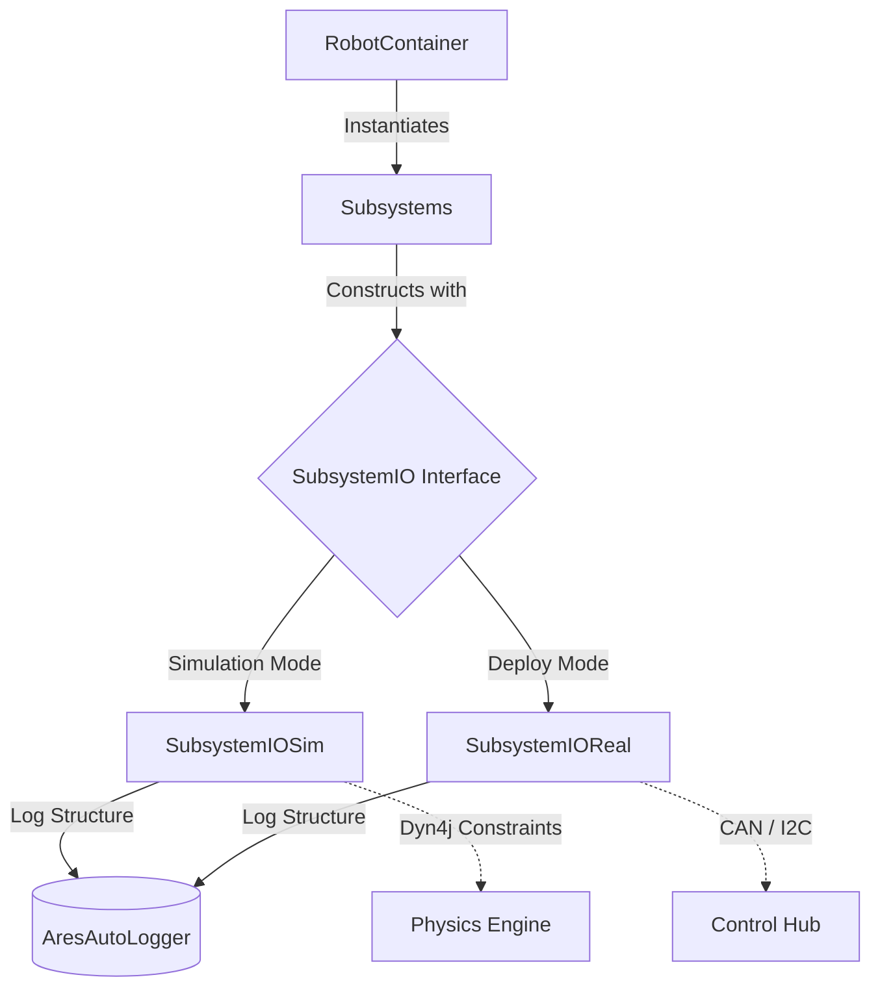

# ARESLib — Championship FTC Command Framework
[](https://github.com/thehomelessguy/ARESLib/actions)
[](https://github.com/thehomelessguy/ARESLib/actions/workflows/ci.yml)
[](https://github.com/thehomelessguy/ARESLib/actions/workflows/ci.yml)

A professional-grade, Command-Based FTC robot framework with AdvantageKit-style telemetry, dyn4j physics simulation, and PathPlanner integration — built for Einstein.

## Quick Start (Mecanum)

1. Click **"Use this template"** on GitHub to create your team's copy.
2. Clone your new repository onto your local machine.
3. Open in your IDE (VS Code or Android Studio).
4. Wait for Gradle sync to complete.
5. Check the **starter templates** in `src/main/java/org/areslib/templates/`:
   - `SimpleIntakeSubsystem.java` — IO pattern + motor + sensor in one file
   - `BasicMecanumAuto.java` — PathPlanner + 3 waypoints
6. Copy a template into your `teamcode/` package and start editing.

> **Recommended:** Start with **Mecanum drive** (`MecanumDriveSubsystem`). It's proven, reliable, and covers 90% of FTC competition needs. Swerve support is available for advanced teams.

---

## Where to Start (Students)

You don't need to understand the whole framework. Here are the 4 things that matter:

| # | Concept | What to Read | Key File |
|:--|:--------|:-------------|:---------|
| 1 | **Commands** — How robot actions are structured | `.agents/skills/areslib-commands/SKILL.md` | `src/.../command/Command.java` |
| 2 | **Architecture** — IO pattern + coordinate systems | `.agents/skills/areslib-architecture/SKILL.md` | `src/.../core/CoordinateUtil.java` |
| 3 | **Faults** — What happens when hardware breaks | `.agents/skills/areslib-faults/SKILL.md` | `src/.../faults/AresFaultManager.java` |
| 4 | **Testing** — How to verify your code works | `.agents/skills/areslib-testing/SKILL.md` | `src/test/java/org/areslib/` |

**When something breaks at competition**, open [`docs/PIT_DEBUGGING.md`](docs/PIT_DEBUGGING.md) — it has a flowchart from controller LED color to the exact AdvantageScope key to check.

---

## Elite Features

| Feature | Description |
|:--------|:------------|
| **Physics Simulation** | Full dyn4j rigid-body contact physics with field boundaries, game piece interaction, and collision logging to AdvantageScope |
| **Dynamic Pathing** | PathPlanner trajectory generation with automated obstacle avoidance |
| **Ghost Mode** | CSV-based teleop macros with lock-free background recording and deterministic re-playback |
| **Shoot-on-the-Move** | Feedforward kinematic aim calculators with target leading |
| **State Machines** | Enum-based state machines with timed transitions, entry/exit actions, and timeout fallbacks |
| **Automated SysId** | Standardized quasistatic and dynamic WPILog routines to extract kS, kV, kA feedforwards |
| **Fault Management** | `AresFaultManager` natively tracks hardware alerts, broadcasts to AdvantageScope, triggers haptic/LED feedback |
| **Sensor Fusion** | Vision + odometry blending with confidence gating and angular shortest-path interpolation |
| **LiDAR Fusion** | Array-based LiDAR raycasting with A* grid injection for real-time obstacle mapping |
| **Traction Control** | 2D slew rate limiter preventing wheel slip from diagonal acceleration vectors |
| **SimSysId Tuner** | Offline OLS regression tool for extracting kS/kV/kA constants from SysId data |

---

## Project Structure

```text
src/main/java/org/areslib/          # Protected Framework Backend
├── command/                        # CommandScheduler, Command, SubsystemBase
├── core/                           # AresCommandOpMode, AresRobot, FieldConstants, CoordinateUtil
│   ├── async/                      # AresAsyncExecutor (off-loop compute)
│   ├── localization/               # AresFollower, AresOdometry
│   └── simulation/                 # AresPhysicsWorld, DecodeFieldSim
├── faults/                         # AresAlert, AresFaultManager, AresDiagnostics
├── hardware/                       # AresHardwareManager, motor/encoder/sensor wrappers
│   └── interfaces/                 # VisionIO, ArrayLidarIO, AresMotor, AresEncoder
├── math/                           # WPILib-ported PID, feedforward, geometry, kinematics
├── subsystems/                     # SwerveDrive, Mecanum, Differential, Vision, LiDAR
├── templates/                      # ★ Starter templates — copy these into your teamcode!
│   ├── SimpleIntakeSubsystem.java  # IO pattern + motor + sensor
│   ├── BasicMecanumAuto.java       # PathPlanner + 3 waypoints
│   ├── FlywheelIO.java / Sim       # Shooter/roller/spinner template
│   ├── LinearMechanismIO.java / Sim # Elevator/slide/lift template
│   └── RotaryMechanismIO.java / Sim # Arm/wrist/pivot template
├── teamcode/                       # Example robot code (mecanum, swerve, elevator, auto)
└── telemetry/                      # AresAutoLogger, AresTelemetry backends
```

---

## IO Abstraction Pattern

ARESLib uses FRC AdvantageKit's IO paradigm. Logic is completely decoupled from hardware through Dependency Injection:



---

## Running the Simulator

```bash
# Windows
.\gradlew.bat runSim

# Mac/Linux
./gradlew runSim
```

Connect AdvantageScope to `localhost:3300` for live telemetry visualization.

## Running Tests

```bash
# Run all 245 test files
.\gradlew.bat test

# Run with verbose output
.\gradlew.bat test --info
```

Test coverage includes:
- **Command system**: CommandScheduler lifecycle (schedule, cancel, interrupt, default commands, reset)
- **Math library**: 24 test files covering PID, feedforward, kinematics, geometry, pose estimators
- **Drive subsystems**: Swerve kinematics, field-centric transform, slew rate limiting, desaturation
- **Vision pipeline**: Quaternion→yaw extraction, ghost rejection, field bounds, confidence scoring
- **Sensor fusion**: Kalman gain, coordinate conversion, angular shortest-path interpolation
- **Physics simulation**: dyn4j field bounds, body collision, LiDAR raycasting
- **Fault management**: Alert registration, severity tracking
- **State machines**: Transition logic, timeouts, entry/exit actions
- **Ghost mode**: Record + playback lifecycle

## Building and Deploying

```bash
# Deploy to REV Control Hub (connect to Control Hub Wi-Fi first)
.\gradlew.bat installDebug
```

## Exploring Data with AdvantageScope

All robot interactions output WPILog telemetry compatible with [AdvantageScope](https://github.com/Mechanical-Advantage/AdvantageScope).

1. **Live data**: Connect to your robot's IP or `localhost:3300` for simulation.
2. **Offline data**: Drag `.wpilog` files into AdvantageScope.

---

## AI Development Skills

ARESLib ships with **21 AI-assistant skill files** in `.agents/skills/` that constrain code generation to framework-correct patterns. Start with the routing table:

| Skill | Purpose |
|:------|:--------|
| **`areslib`** | **★ Start here — routing table to all 20 domain skills** |
| `areslib-architecture` | Root rules: IO pattern, coordinate systems, engineering quirks |
| `areslib-autonomous` | Path following, ghost replay, shoot-on-the-move, avoidance |
| `areslib-ci` | GitHub Actions CI/CD build pipeline |
| `areslib-commands` | CommandScheduler lifecycle, AresGamepad bindings |
| `areslib-drivetrain` | Swerve, mecanum, differential kinematics + odometry |
| `areslib-faults` | AresAlert, AresFaultManager, AresDiagnostics |
| `areslib-hardware` | Motor/sensor wrappers, coprocessors, IOReal patterns |
| `areslib-math` | PID controllers, feedforwards, motion profiles, filters |
| `areslib-simulation` | dyn4j physics, AresPhysicsWorld, LiDAR raycasting |
| `areslib-statemachine` | Enum-based StateMachine framework |
| `areslib-telemetry` | AresAutoLogger, AresTelemetry backend routing |
| `areslib-testing` | Headless JUnit 5, physics-integrated test patterns |
| `areslib-vision` | VisionIO, multi-camera fusion, AprilTag pipelines |
| `advantagescope-layouts` | Layout JSON configuration via MCP tools |
| `advantagescope-hud-sim` | Gamepad mappings, Java 2D rendering for sim |
| `gradle-ftc-desktop` | AAR extraction for desktop simulation builds |
| `robot-dev` | Build, deploy, ADB debugging workflow |
| `skill-authoring` | Meta-skill for creating new AI skills |

---

## Acknowledgements & Licensing

- **[WPILib](https://github.com/wpilibsuite/allwpilib)** — Foundational kinematics, geometry, and pose estimator architectures (BSD-3-Clause). See [WPILIB-LICENSE.md](WPILIB-LICENSE.md).
- **[PathPlanner](https://github.com/mjansen4857/pathplanner)** — Trajectory generation and path planning.
- **[AdvantageKit & AdvantageScope](https://github.com/Mechanical-Advantage/AdvantageKit)** — Deterministic logging architecture, recreated structurally within ARESLib.
- **[dyn4j](https://github.com/dyn4j/dyn4j)** — 100% Java pure 2D rigid-body physics engine powering simulation.
