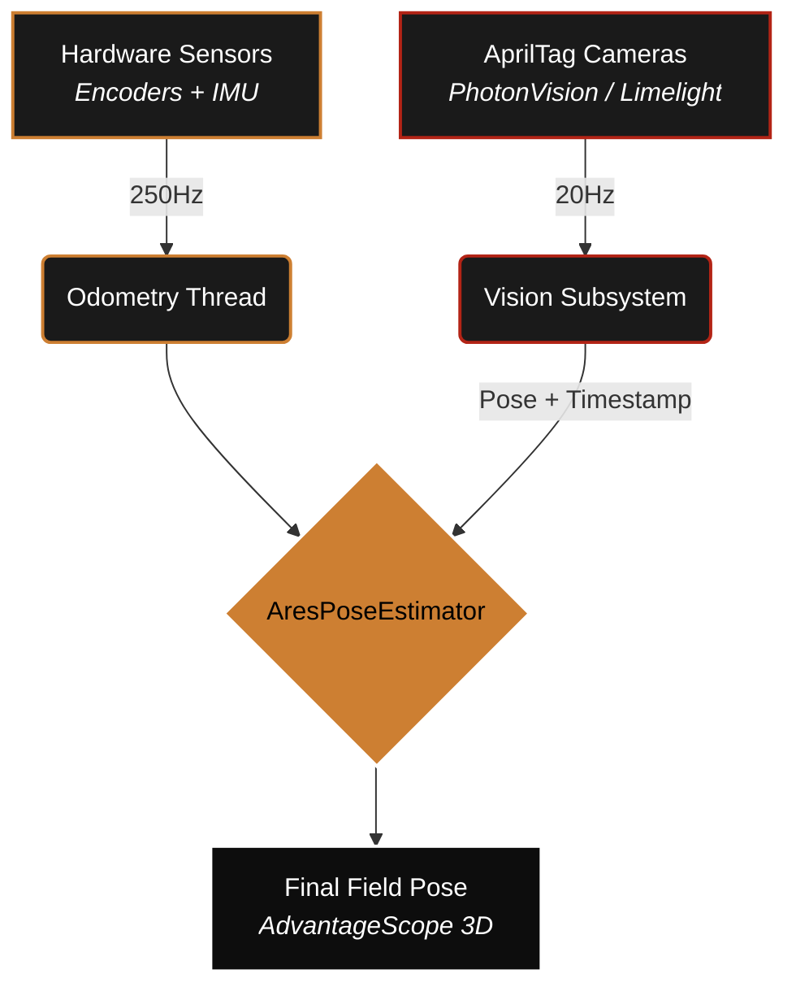

# Vision Fusion

High-fidelity localization using MegaTag 2.0 and latency-compensating rollback. Odometry is fast but drifts; vision is global but slow. **Vision Fusion** combines both into a single source of truth.



:::tip Source of Truth
ARESLib uses a weighted pose estimator that accepts global vision measurements while maintaining a high-frequency (250Hz) odometry base.
:::

## 1. The Fusion Pipeline

Fusion happens in three distinct layers to ensure reliability under competition stress:

1.  **Hardware Sensors (250Hz)**: Encoders and IMUs provide ultra-low latency movement data.
2.  **Vision Pipeline (20Hz)**: AprilTag cameras provide absolute field coordinates.
3.  **AresPoseEstimator**: Fuses both sources using a latency-aware Kalman-style filter.

## 2. MegaTag 2.0 & Pose Seeding

Traditional vision pose estimation (PnP) creates large "jumps" when tags are at awkward angles. ARESLib supports **MegaTag 2.0**, which uses the robot's IMU heading to "seed" the vision solve.

By using the IMU to define the "Down" vector, the vision system only needs to solve for 2D translation and 1D rotation. This significantly reduces "pose ambiguity" and prevents the robot from "teleporting" into the floor or ceiling in the dashboard.

## 3. Lag Compensation (Rollback)

Vision measurements are always "old" (e.g., 50ms latency) by the time the code receives them. The `VisionFusionHelper` handles this by:
1.  **Buffering**: Maintaining a timestamped history of previous odometry poses.
2.  **Rollback**: When a 50ms-old vision sample arrives, the estimator "jumps back" in time to that exact timestamp.
3.  **Correction**: It calculates the error between the vision sample and the historical odometry sample.
4.  **Replay**: It applies the correction and then "replays" all movement that happened in the last 50ms to reach the current "best estimate."

## 4. Tuning Trust (StdDevs)

You can tell the estimator how much to "trust" a vision measurement by adjusting the **Standard Deviations**.

```java
// Config inside AresPoseEstimator
m_poseEstimator.setVisionMeasurementStdDevs(
    VecBuilder.fill(0.1, 0.1, Units.degreesToRadians(5.0))
);
```

:::warning Dynamic Trust
ARESLib automatically scales trust based on distance. If a tag is 5 meters away, we trust it less than a tag that is 1 meter away. This prevents noisy, distant measurements from corrupting your high-precision pose.
:::
