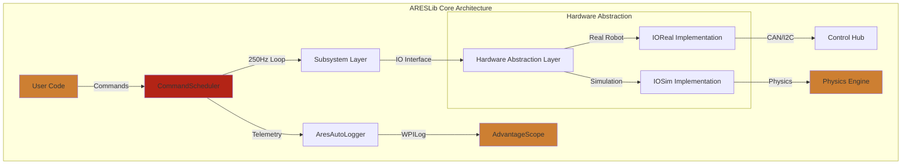
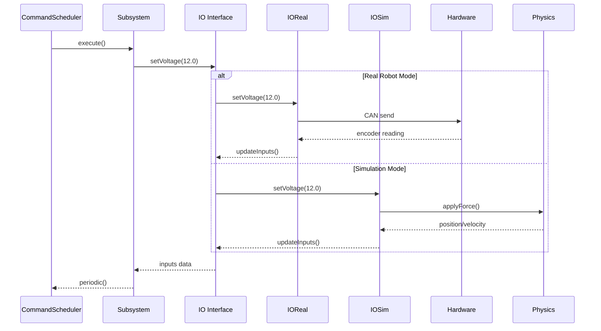
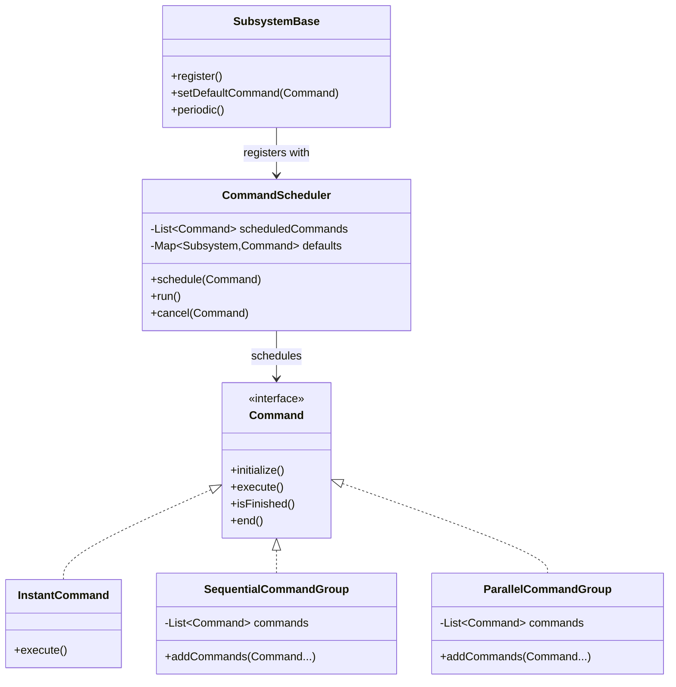
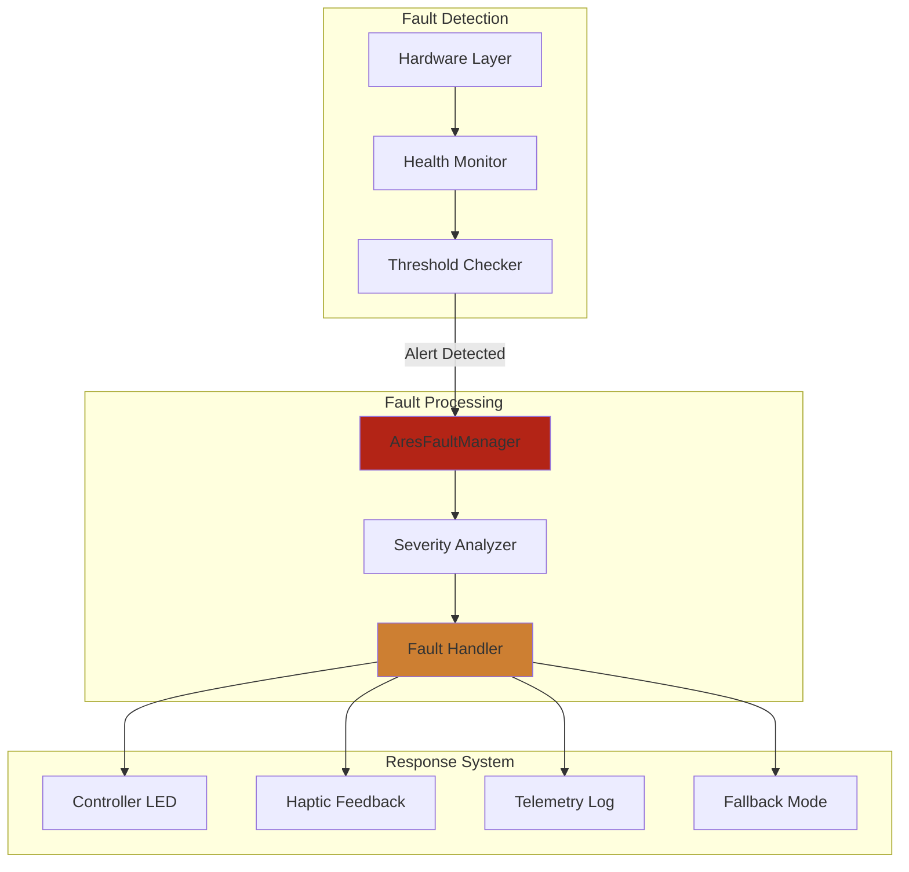
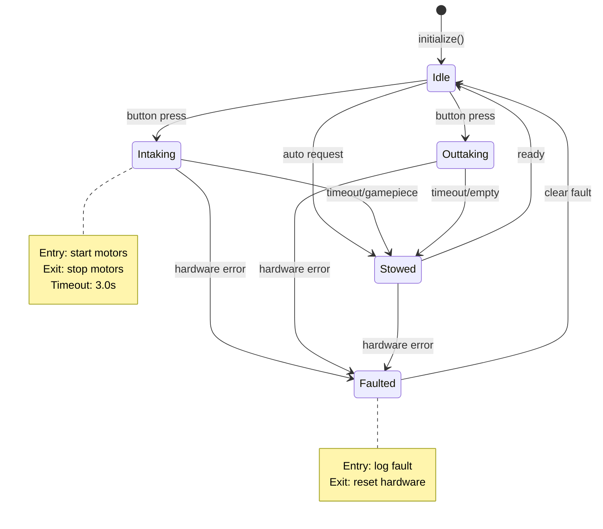
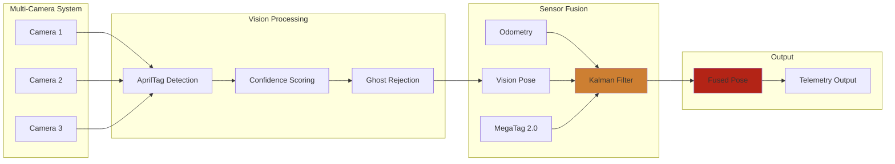
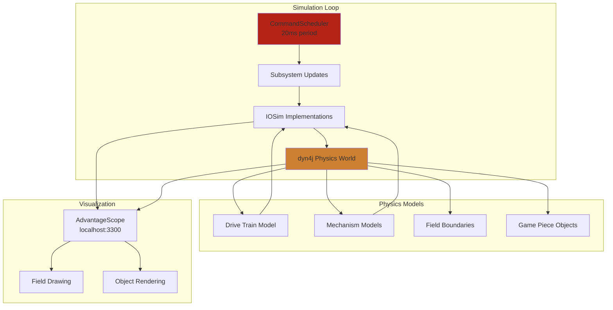

import { Card, CardGrid } from '@astrojs/starlight/components';

# Architecture Diagrams

These diagrams help you understand how ARESLib's components interact and how data flows through the system.

## Core Architecture Overview



## IO Pattern Data Flow



## Command System Hierarchy



## Fault Management System



## State Machine Framework



## Vision Fusion Pipeline



## Physics Simulation Integration



## Telemetry & Logging System

```mermaid
flowchart LR
    subgraph "Data Sources"
        Sub[Subsystems]
        IO[IO Implementations]
        Commands[Commands]
        State[State Machines]
    end

    subgraph "Logging Layer"
        AutoLog[@AutoLog Processor]
        Buffer[Zero-Alloc Buffer]
        WPILog[WPILog Backend]
    end

    subgraph "Data Flow"
        Real[Real-time]
        Replay[Replay Mode]
        Remote[Remote Access]
    end

    subgraph "Consumers"
        AS[AdvantageScope]
        Dashboard[FTC Dashboard]
        Analysis[Post-Match Analysis]
    end

    Sub --> AutoLog
    IO --> AutoLog
    Commands --> AutoLog
    State --> AutoLog

    AutoLog --> Buffer
    Buffer --> WPILog

    WPILog --> Real
    WPILog --> Replay
    WPILog --> Remote

    Real --> AS
    Real --> Dashboard
    Replay --> Analysis

    style AutoLog fill:#CD7F32
    style WPILog fill:#B32416
```

## How to Use These Diagrams

<CardGrid>
    <Card title="System Integration" icon="layers">
        Use the Core Architecture diagram to understand how all ARESLib components connect.
    </Card>
    <Card title="IO Pattern Implementation" icon="code">
        Reference the IO Pattern diagram when implementing new subsystems with hardware abstraction.
    </Card>
    <Card title="Command Creation" icon="pencil">
        Use the Command System diagram when creating complex command groups for autonomous routines.
    </Card>
    <Card title="Fault Debugging" icon="alert">
        Consult the Fault Management diagram when troubleshooting hardware issues and alert responses.
    </Card>
    <Card title="State Machine Design" icon="workflow">
        Reference the State Machine diagram when designing complex robot behaviors with timeouts.
    </Card>
    <Card title="Vision Integration" icon="eye">
        Use the Vision Fusion diagram when setting up multi-camera systems and pose estimation.
    </Card>
</CardGrid>

## Additional Resources

- [Hardware Abstraction Tutorial](/tutorials/hardware-abstraction/) - Deep dive into IO pattern
- [Fault Resilience](/tutorials/fault-resilience/) - Implementing robust fault handling
- [Vision Fusion](/tutorials/vision-fusion/) - Multi-camera setup and tuning
- [Physics Simulation](/tutorials/physics-sim/) - Desktop simulation setup