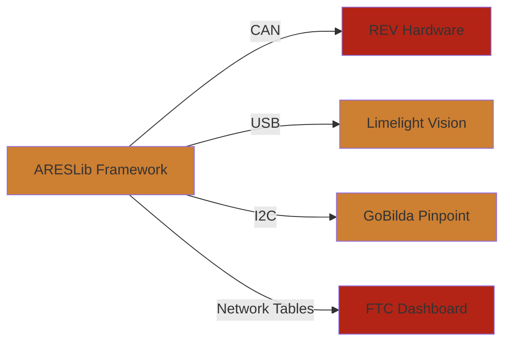

import ScreenshotGallery from '../../../components/ScreenshotGallery';

# Media Gallery

Visual guides and screenshots showing ARESLib in action. See what's possible with championship-grade FTC software.

## Featured Screenshots

<ScreenshotGallery />

## Before & After Comparisons

### Performance Comparison

#### Traditional FTC Code
- **Loop Rate**: ~50Hz with inconsistent timing
- **Memory**: Frequent GC pauses causing robot freezes
- **Debugging**: Limited telemetry, hard to reproduce issues
- **Testing**: Requires hardware, no simulation support

#### ARESLib Framework
- **Loop Rate**: Deterministic 250Hz with zero heap allocation
- **Memory**: Zero-allocation hot path, no GC pauses
- **Debugging**: Full telemetry logging with bit-perfect replay
- **Testing**: Desktop simulation with physics engine

## Dashboard Examples

### AdvantageScope Layouts

**Swerve Drive Dashboard**
- Real-time module position visualization
- Pose estimation with odometry/vision fusion
- Path following trajectory display
- Motor current and voltage monitoring

**Vision System Dashboard**
- Multi-camera AprilTag detection overlay
- Confidence scoring and ghost rejection
- MegaTag 2.0 localization data
- Field coordinate transformation display

**Mechanism Control**
- Elevator position and velocity graphs
- Flywheel RPM with feedforward tracking
- Intake state machine visualization
- Automated SysId data collection

### FTC Dashboard Integration

**Configuration Variables**
- Live tuning of PID constants
- Feedforward coefficient adjustment
- Trajectory parameter modification
- State machine timeout configuration

**Camera Streaming**
- Multi-view camera display
- AprilTag detection overlay
- Field drawing and robot pose
- Recording and playback functionality

## Video Tutorials

### Getting Started Series
1. **Installation & Setup** (5 min)
   - Clone and build ARESLib project
   - Configure development environment
   - Run first simulation test

2. **Your First Subsystem** (8 min)
   - Create IO interface and implementations
   - Build subsystem with hardware abstraction
   - Test with simulation and real hardware

3. **Command-Based Programming** (10 min)
   - Create instant and composite commands
   - Setup command scheduler
   - Bind gamepad controls

### Advanced Topics
1. **Physics Simulation** (12 min)
   - Setup dyn4j physics world
   - Create mechanism models
   - Test autonomous without robot

2. **Vision Fusion** (15 min)
   - Multi-camera setup
   - Kalman filtering implementation
   - MegaTag 2.0 integration

3. **Performance Tuning** (10 min)
   - Zero-allocation patterns
   - Performance profiling
   - Memory optimization techniques

## Field Layouts

### CENTERSTAGE Field (2023-2024)
- Pixel detection and navigation
- Spike marking localization
- Backdrop alignment precision

### INTO THE DEEP Field (2024-2025)
- Submersible positioning
- Sample collection trajectories
- Ascent height optimization

## Integration Examples

### Hardware Partners

## How to Contribute

Have an amazing screenshot, video, or visualization of your ARESLib setup? We'd love to feature it!

**Submission Guidelines:**
- High-resolution screenshots (min 1920x1080)
- Clear labels and annotations
- Brief description of the setup
- Your team name and number

Submit via: [GitHub Issues](https://github.com/ARES-23247/ARESLib/issues) with label `media`