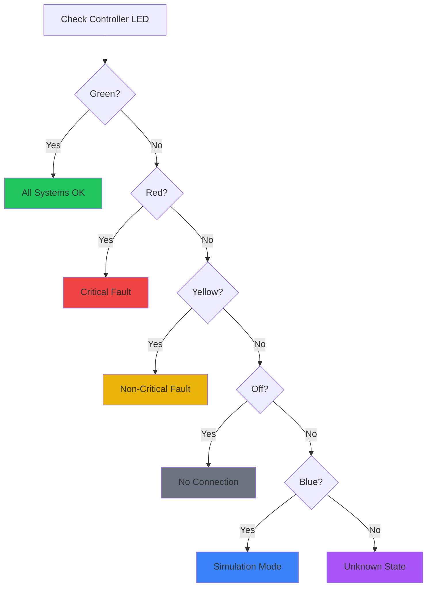
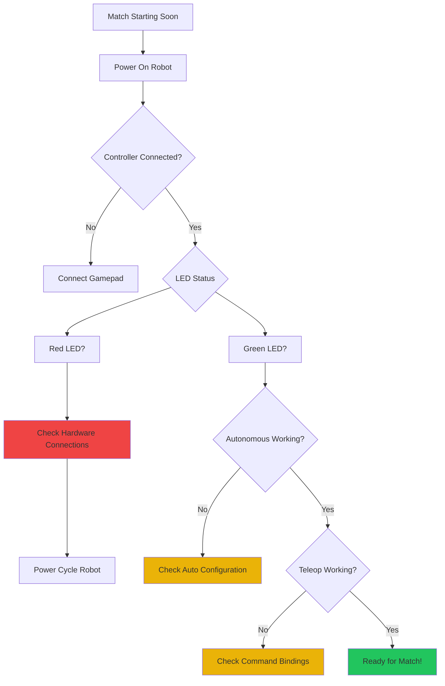

import { Card, CardGrid } from '@astrojs/starlight/components';

# Troubleshooting Hub

Comprehensive guide to diagnosing and fixing issues with ARESLib, from development problems to competition pit debugging.

## Quick Diagnostics

### LED Status Indicator

Your controller LED provides immediate feedback on robot status:



### Common LED States

| LED Color | Meaning | Action Required |
|-----------|---------|-----------------|
| 🟢 Green | All systems operational | None - robot is ready |
| 🔴 Red | Critical fault detected | Check hardware connections immediately |
| 🟡 Yellow | Non-critical warning | Monitor performance, check logs |
| 🔵 Blue | Simulation mode active | Normal for development |
| ⚫ Off | No controller connection | Check gamepad/USB connection |
| 🟣 Purple | Low battery | Replace controller batteries |

## Competition Pit Debugging

### Pre-Match Checklist



### Quick Fixes (Pit Side)

#### Hardware Issues

**Motor Not Responding:**
```java
// Check AdvantageScope for motor faults
// Verify CAN address matches hardwareMap
// Test motor with basic OpMode first
```

**Encoder Not Reading:**
```java
// Check encoder cable connection
// Verify encoder type matches configuration
// Look for "Encoder Fault" in AdvantageScope
```

**Servo Not Moving:**
```java
// Verify servo PWM port
// Check servo voltage (5V vs 6V)
// Test servo calibration
```

#### Software Issues

**Robot Not Moving:**
```java
// Check if default command is scheduled
// Verify gamepad bindings are configured
// Look for command scheduler errors in log
```

**Autonomous Not Running:**
```java
// Verify autonomous OpMode is selected
// Check autonomous command is scheduled in autoInit()
// Test path following in simulation first
```

## Common Error Messages

### Build Errors

#### "Cannot find symbol: DriveIO"

**Cause:** IO interface not imported or doesn't exist

**Solution:**
```java
// Make sure IO interface exists
public interface DriveIO {
    // Interface methods
}

// Import in subsystem
import org.yourteam.lib.io.DriveIO;
```

#### "NoSuchMethodException: updateInputs"

**Cause:** `@AutoLog` annotation processor not running

**Solution:**
```gradle
// Ensure annotation processing is enabled in build.gradle
android {
    compileOptions {
        annotationProcessorEnabled true
    }
}

// Clean and rebuild
./gradlew clean build
```

### Runtime Errors

#### "NullPointerException in Command"

**Cause:** Subsystem not initialized before command

**Solution:**
```java
// Bad: Subsystem not initialized
public class RobotContainer {
    private DriveSubsystem drive;
    // drive is null!

    public RobotContainer() {
        // Forgot to initialize drive
    }
}

// Good: Initialize subsystems first
public class RobotContainer {
    private final DriveSubsystem drive;

    public RobotContainer() {
        drive = new DriveSubsystem(new DriveIOReal());
        // Now drive is not null
    }
}
```

#### "Robot stuck in initialization loop"

**Cause:** Command blocking in `initialize()` method

**Solution:**
```java
// Bad: Blocking call
@Override
public void initialize() {
    Thread.sleep(1000); // NEVER do this!
}

// Good: Use timer or state
private final Timer timer = new Timer();

@Override
public void initialize() {
    timer.reset();
    timer.start();
}

@Override
public boolean isFinished() {
    return timer.hasElapsed(1.0);
}
```

## Performance Issues

### Robot Running Slowly

**Symptoms:**
- Loop frequency below 200Hz
- Laggy response to controls
- GC pauses visible in AdvantageScope

**Solutions:**
```java
// Bad: Creating objects in loop
@Override
public void periodic() {
    List<Double> values = new ArrayList<>(); // BAD!
    values.add(sensor.getValue());
}

// Good: Reuse objects
private final List<Double> values = new ArrayList<>();

@Override
public void periodic() {
    values.clear();
    values.add(sensor.getValue());
}
```

### High Memory Usage

**Symptoms:**
- Memory increasing over time
- Robot slows down after extended use
- "Out of memory" errors

**Solutions:**
```java
// Bad: Not clearing collections
private final List<Object> cache = new ArrayList<>();

public void addToCache(Object obj) {
    cache.add(obj); // Never cleared!
}

// Good: Manage memory properly
private final List<Object> cache = new ArrayList<>();

public void addToCache(Object obj) {
    if (cache.size() > 100) {
        cache.clear(); // Prevent memory leak
    }
    cache.add(obj);
}
```

## AdvantageScope Debugging

### Key Metrics to Monitor

**Drive Train:**
- Loop frequency (should be ~250Hz)
- Motor currents (watch for spikes)
- Odometry drift (compare to reality)
- Path following error

**Mechanisms:**
- Position vs target
- Motor voltage output
- Encoder velocity
- Limit switch states

**Vision:**
- AprilTag detection count
- Pose estimation confidence
- FPS (frames per second)
- Latency (should be <50ms)

### Common Graph Patterns

#### Normal Operation
```
Loop Rate:    ━━━━━━━━━━━━━━━━━━ 250Hz
Motor Current: ▂▂▃▃▄▄▅▅▆▆▇▇██▇▇▆▆▅▅▄▄▃▃▂▂
Position:      ╱╲╱╲╱╲╱╲╱╲╱╲╱╲
```

#### Problem: Mechanical Issue
```
Motor Current: ▂▂▃▃▄▄▅▅▆▆▇▇████████ (stuck high!)
Position:      ╱╲╱╲╱╲╱╲╲╱╱╲╱╲ (inconsistent)
```

#### Problem: Control Loop Issue
```
Loop Rate:    ━━━━━━━━━━━━━━━━━━━ (drops below 100Hz!)
```

## Hardware Debugging

### Motor Issues

**Motor Not Spinning:**
1. Check motor controller LED status
2. Verify motor is in `RUN_USING_ENCODER` mode
3. Check motor power cables
4. Test with basic OpMode

**Motor Drifting When Stopped:**
```java
// Bad: Using setPower(0)
motor.setPower(0); // Motor may still drift

// Good: Use zero power behavior
motor.setZeroPowerBehavior(DcMotor.ZeroPowerBehavior.BRAKE);
motor.setPower(0);
```

### Encoder Issues

**Encoder Reading Wrong Direction:**
```java
// Fix encoder direction
motor.setDirection(DcMotorSimple.Direction.REVERSE);
```

**Encoder Not Counting:**
1. Check encoder cable connection
2. Verify encoder is plugged into correct port
3. Test encoder with basic OpMode

**Encoder Jittery Values:**
```java
// Add filtering to noisy encoder
private final MedianFilter filter = new MedianFilter(5);

public double getFilteredPosition() {
    return filter.calculate(motor.getCurrentPosition());
}
```

## Network & Connection Issues

### Robot Not Connecting to Phone

**Symptoms:**
- "No Robot Controller" message
- Can't see robot in available devices
- Frequent disconnections

**Solutions:**
1. Check Control Hub Wi-Fi is on
2. Verify phone Wi-Fi is enabled
3. Restart both robot controller and phone
4. Check for interference from other networks

### AdvantageScope Not Connecting

**Symptoms:**
- Can't connect to robot
- No data showing in dashboard
- Connection timeout errors

**Solutions:**
1. Verify robot is on same network
2. Check firewall settings
3. Use correct IP address (check Driver Station)
4. Test with `localhost:3300` for simulation

## Competition Emergency Procedures

### Autonomous Failure During Match

**Immediate Actions:**
1. Don't panic - robot can still score in teleop
2. Switch to manual control if possible
3. Note what failed for post-match analysis
4. Focus on teleop performance

**Post-Match Analysis:**
1. Check AdvantageScope logs
2. Review autonomous code for timing issues
3. Verify sensor readings during auto
4. Test in simulation before next match

### Teleop Control Issues

**If Robot Won't Move:**
1. Check if any fault LEDs are active
2. Verify gamepad is connected
3. Try restarting OpMode (don't reboot robot)
4. Check if default command is scheduled

**If Robot Behavior Changed:**
1. Check if @Config variables changed
2. Verify no code changes since last test
3. Check for sensor calibration drift
4. Review recent AdvantageScope logs

## Getting Help

### When to Ask for Help

- ✅ After checking LED status
- ✅ After reviewing AdvantageScope logs
- ✅ After trying basic troubleshooting
- ✅ When error doesn't match documentation

### How to Get Effective Help

**Provide This Information:**
1. LED color on controller
2. Error message (exact text)
3. AdvantageScope screenshots
4. When the problem occurs (auto/teleop)
5. Recent changes to code/hardware

**Where to Ask:**
- [GitHub Issues](https://github.com/ARES-23247/ARESLib/issues) - Bug reports
- [GitHub Discussions](https://github.com/ARES-23247/ARESLib/discussions) - Questions
- [FTC Community](https://ftc-community.firstinspires.org/) - General FTC help
- [Team Discord/Slack] - Team-specific help

## Diagnostic Tools

### Built-in Diagnostics

```java
// ARESLib provides diagnostic commands
public class DiagnosticsOpMode extends AresCommandOpMode {
    @Override
    public void robotInit() {
        // Run system diagnostics
        CommandScheduler.getInstance()
            .schedule(new HardwareDiagnosticsCommand());
    }
}
```

### Custom Diagnostics

```java
public class CustomDiagnosticsCommand extends Command {
    private final List<Subsystem> subsystems;

    public CustomDiagnosticsCommand(List<Subsystem> subsystems) {
        this.subsystems = subsystems;
    }

    @Override
    public void execute() {
        for (Subsystem subsystem : subsystems) {
            // Check subsystem health
            if (!subsystem.isHealthy()) {
                telemetry.addData("FAULT", subsystem.getName());
            }
        }
    }
}
```

## Prevention & Best Practices

### Pre-Competition Checklist

- [ ] Test all subsystems in simulation
- [ ] Run autonomous routine at least 10 times
- [ ] Verify AdvantageScope logging works
- [ ] Check all hardware connections
- [ ] Test emergency stop procedures
- [ ] Verify gamepad bindings
- [ ] Check battery levels (robot + controllers)
- [ ] Review recent code changes

### Regular Maintenance

**Daily:**
- Check battery voltage
- Inspect cables and connections
- Review AdvantageScope logs for trends

**Weekly:**
- Run full diagnostic suite
- Test autonomous routines
- Verify sensor calibration
- Update firmware if needed

**Competition:**
- Complete pit checklist
- Practice emergency procedures
- Backup working code
- Document any changes

## Quick Reference Cards

<CardGrid>
    <Card title="LED Status" icon="lightbulb">
        Green = Good, Red = Critical, Yellow = Warning, Blue = Sim
    </Card>
    <Card title="Emergency Stop" icon="alert">
        Disable robot via Driver Station, check for hardware faults
    </Card>
    <Card title="Data Logging" icon="chart">
        Always record AdvantageScope logs for analysis
    </Card>
    <Card title="Testing" icon="check-circle">
        Test in simulation before deploying to robot
    </Card>
</CardGrid>

## Additional Resources

- [PIT_DEBUGGING.md](https://github.com/ARES-23247/ARESLib/blob/main/docs/PIT_DEBUGGING.md) - Competition debugging
- [Fault Resilience](/tutorials/fault-resilience/) - Building reliable robots
- [Health Checks](/tutorials/health-checks/) - Pre-match diagnostics
- [Championship Testing](/tutorials/championship-testing/) - Testing methodology