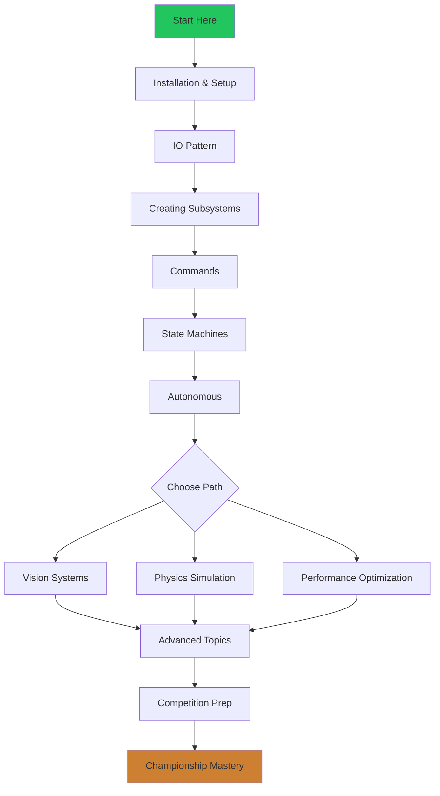

import { Card, CardGrid } from '@astrojs/starlight/components';

# Video Tutorials

Learn ARESLib through comprehensive video tutorials covering everything from basic setup to advanced championship features.

## Getting Started Series

### 1. Installation & Setup (5:32)
**Beginner** | First Steps

Learn how to set up your development environment and create your first ARESLib project.

**Topics Covered:**
- Cloning the ARESLib repository
- Configuring Android Studio/VS Code
- Understanding project structure
- Running your first simulation test
- Deploying to the Control Hub

**Prerequisites:**
- Basic Java knowledge
- FTC SDK installed
- Control Hub or simulation environment

**Code Examples:**
```java
// Your first ARESLib OpMode
@TeleOp
public class MyFirstOpMode extends AresCommandOpMode {
    private RobotContainer robot;

    @Override
    public void robotInit() {
        robot = new RobotContainer();
    }

    @Override
    public void robotPeriodic() {
        CommandScheduler.getInstance().run();
    }
}
```

---

### 2. Understanding the IO Pattern (8:45)
**Beginner** | Core Concepts

Master ARESLib's hardware abstraction layer and IO pattern for simulation-ready code.

**Topics Covered:**
- Why use the IO pattern?
- Creating IO interfaces
- Implementing IOReal and IOSim
- Testing without hardware
- Common pitfalls to avoid

**Key Concepts:**
```java
// IO Interface Pattern
public interface DriveIO {
    @AutoLog
    public static class DriveIOInputs {
        public double leftPositionMeters = 0.0;
        public double rightPositionMeters = 0.0;
    }

    void setVoltage(double leftVolts, double rightVolts);
    void updateInputs(DriveIOInputs inputs);
}
```

---

### 3. Creating Your First Subsystem (12:18)
**Beginner** | Subsystems

Build a complete subsystem with hardware abstraction and testing.

**Topics Covered:**
- Designing subsystem architecture
- Implementing periodic() methods
- Adding telemetry with @AutoLog
- Writing unit tests
- Testing in simulation

**Complete Example:**
```java
public class IntakeSubsystem extends SubsystemBase {
    private final IntakeIO io;
    private final IntakeIOInputs inputs = new IntakeIOInputs();

    public IntakeSubsystem(IntakeIO io) {
        this.io = io;
    }

    @Override
    public void periodic() {
        io.updateInputs(inputs);
        // Automatic logging via @AutoLog
    }

    public void intake() {
        io.setMotorVolts(12.0);
    }
}
```

---

## Intermediate Series

### 4. Command-Based Programming (15:30)
**Intermediate** | Commands

Learn to create and organize commands for complex robot behaviors.

**Topics Covered:**
- Instant vs. continuous commands
- Command groups (sequential, parallel)
- Command scheduling and interruption
- Default commands
- Gamepad button bindings

**Advanced Patterns:**
```java
// Complex command composition
public class AutoScoreCommand extends SequentialCommandGroup {
    public AutoScoreCommand(DriveSubsystem drive, IntakeSubsystem intake) {
        addCommands(
            new PathToIntakeCommand(drive),
            new IntakeCommand(intake).withTimeout(2.0),
            new PathToScoreCommand(drive),
            new ScoreCommand(intake),
            new ResetCommand(intake)
        );
    }
}
```

---

### 5. State Machines (18:45)
**Intermediate** | State Machines

Build reliable state machines for complex subsystem behaviors.

**Topics Covered:**
- State machine design principles
- Defining states and transitions
- Entry/exit actions
- Timeout-based transitions
- Fault recovery

**Real Example:**
```java
public enum ElevatorState {
    GROUND(0),
    LOW(10),
    HIGH(20),
    STOWED(5);

    final double targetHeightInches;
}

public class ElevatorStateMachine extends StateMachine<ElevatorState> {
    // Automatic state management
    // Timeout-based transitions
    // Fault detection and recovery
}
```

---

### 6. Path Following & Autonomous (22:15)
**Intermediate** | Autonomous

Create reliable autonomous routines with PathPlanner integration.

**Topics Covered:**
- Creating paths with PathPlanner GUI
- Loading and following paths
- Odometry and vision fusion
- Timing and coordination
- Debugging autonomous issues

**Competition Example:**
```java
public class ChampionshipAuto extends SequentialCommandGroup {
    public ChampionshipAuto(DriveSubsystem drive, ShooterSubsystem shooter) {
        addCommands(
            new InstantCommand(() -> drive.resetOdometry(startPose)),
            new FollowPathCommand(drive, "Preload"),
            new AutoAimCommand(shooter),
            new ShootCommand(shooter).withTimeout(2.0),
            new FollowPathCommand(drive, "ToIntake2"),
            new IntakeCommand(intake).withTimeout(2.0)
        );
    }
}
```

---

## Advanced Series

### 7. Vision Systems & AprilTag (25:40)
**Advanced** | Vision

Implement multi-camera vision systems with pose estimation and fusion.

**Topics Covered:**
- AprilTag detection and pose estimation
- Multi-camera setup and calibration
- Vision-odometry fusion
- MegaTag 2.0 integration
- Ghost rejection and confidence scoring

**Advanced Implementation:**
```java
public class VisionFusion extends SubsystemBase {
    private final AprilTagDetector[] cameras;
    private final AresOdometry odometry;

    public void addVisionMeasurements() {
        for (AprilTagDetection detection : getDetections()) {
            if (detection.getConfidence() > 0.8) {
                odometry.addVisionMeasurement(
                    detection.getPose(),
                    detection.getTimestamp()
                );
            }
        }
    }
}
```

---

### 8. Physics Simulation (20:30)
**Advanced** | Simulation

Master ARESLib's physics simulation for development without hardware.

**Topics Covered:**
- Setting up the physics world
- Creating mechanism models
- Field boundaries and game pieces
- Collision detection and response
- Debugging with AdvantageScope

**Physics Example:**
```java
public class ElevatorIOSim implements ElevatorIO {
    private final ElevatorSim sim = new ElevatorSim(
        DCMotor.getNEO(1),
        10.0,  // Gear ratio
        0.02,  // Drum radius (meters)
        0.5,   // Carriage mass (kg)
        0.6,   // Min height (meters)
        1.2    // Max height (meters)
    );

    @Override
    public void updateInputs(ElevatorIOInputs inputs) {
        sim.update(0.020); // 20ms physics step
        inputs.positionMeters = sim.getPositionMeters();
        inputs.velocityMetersPerSec = sim.getVelocityMetersPerSec();
    }
}
```

---

### 9. Performance Optimization (18:20)
**Advanced** | Performance

Learn zero-allocation patterns and performance optimization techniques.

**Topics Covered:**
- Understanding Java garbage collection
- Zero-allocation patterns
- Memory profiling and analysis
- CPU optimization
- Benchmarking and testing

**Optimization Techniques:**
```java
// Bad: Allocates in loop
@Override
public void periodic() {
    List<Double> values = new ArrayList<>(); // New object every loop!
    values.add(sensor.getValue());
}

// Good: Reuses objects
private final List<Double> values = new ArrayList<>();

@Override
public void periodic() {
    values.clear();
    values.add(sensor.getValue());
}
```

---

## Competition Preparation

### 10. Championship Testing Strategies (16:45)
**Advanced** | Testing

Develop comprehensive testing strategies for competition success.

**Topics Covered:**
- Unit testing with JUnit 5
- Integration testing patterns
- Simulation testing workflows
- Hardware-in-the-loop testing
- Competition pit testing

**Testing Framework:**
```java
@Test
public void testIntakeCommand() {
    // Arrange
    MockIntakeIO mockIO = new MockIntakeIO();
    IntakeSubsystem intake = new IntakeSubsystem(mockIO);
    IntakeCommand command = new IntakeCommand(intake);

    // Act
    command.initialize();
    command.execute();

    // Assert
    assertEquals(12.0, mockIO.getMotorVolts(), 0.01);
    assertTrue(intake.hasGamepiece());
}
```

---

### 11. Fault Management & Reliability (14:30)
**Advanced** | Reliability

Build fault-tolerant systems for competition reliability.

**Topics Covered:**
- Fault detection and classification
- Automatic recovery strategies
- LED and haptic feedback
- Logging and diagnostics
- Competition pit debugging

**Fault Management:**
```java
public class AresFaultManager {
    public void registerFault(AresFault fault) {
        if (fault.getSeverity() == Severity.CRITICAL) {
            // Immediate action
            ledController.setPattern(LEDPattern.RED);
            triggerSafeMode();
            logFault(fault);
        }
    }
}
```

---

## Special Topics

### 12. Advanced Telemetry with AdvantageScope (20:15)
**Intermediate** | Telemetry

Master ARESLib's telemetry system for competition debugging and analysis.

**Topics Covered:**
- @AutoLog annotation usage
- Custom telemetry fields
- AdvantageScope dashboard setup
- Replay and analysis
- Real-time debugging

---

### 13. Mecanum Drive Systems (17:40)
**Intermediate** | Drivetrains

Implement and tune mecanum drive systems with field-centric control.

**Topics Covered:**
- Mecanum kinematics
- Field-centric control
- Odometry implementation
- Traction control
- Path following

---

### 14. Swerve Drive Programming (25:00)
**Advanced** | Drivetrains

Build advanced swerve drive systems with module-level control.

**Topics Covered:**
- Swerve module kinematics
- Module state optimization
- Odometry and localization
- Path following for swerve
- Vision integration

---

### 15. Shoot-on-the-Move Systems (22:30)
**Advanced** | Game Pieces

Implement shooting systems that work while robot is moving.

**Topics Covered:**
- Target leading algorithms
- Feedforward kinematics
- Vision-aimed shooting
- Timing and coordination
- Error compensation

---

## Quick Reference Guides

### 3-Minute Tutorials

**Quick Setup (3:45)**
- Clone and run in 3 minutes
- Basic teleop setup
- Deploy to robot

**Common Commands (4:20)**
- Instant commands
- Command groups
- Button bindings

**Debugging Tips (5:10)**
- Reading AdvantageScope graphs
- Common error solutions
- LED status meanings

---

## Tutorial Roadmap



## Learning Paths

### Beginner Path (New Teams)
1. Installation & Setup
2. Understanding the IO Pattern
3. Creating Your First Subsystem
4. Command-Based Programming
5. Basic Autonomous

**Time Commitment:** 3-4 hours
**Outcome:** Functional competition-ready robot

### Intermediate Path (Experience Teams)
1. State Machines
2. Path Following & Autonomous
3. Advanced Telemetry
4. Vision Systems & AprilTag
5. Competition Preparation

**Time Commitment:** 5-6 hours
**Outcome:** Advanced autonomous and vision systems

### Advanced Path (Championship Teams)
1. Physics Simulation
2. Performance Optimization
3. Shoot-on-the-Move
4. Fault Management & Reliability
5. Championship Testing Strategies

**Time Commitment:** 4-5 hours
**Outcome:** Championship-caliber software

---

## Community Contributions

### Featured Content Creators

**Team 23247 - ARES Robotics**
- 15+ tutorial videos
- Competition footage
- Code reviews

**Team 18968 - Steel City Robotics**
- Beginner-friendly tutorials
- Learning series
- Tips and tricks

**Team 20593 - Quantum Robotics**
- Advanced topics
- Performance optimization
- Deep dives

---

## Upcoming Content

### Planned Releases

**Summer 2025:**
- Differential drive programming
- Advanced path planning
- Machine learning integration
- Real-time video processing

**Fall 2025:**
- Season game-specific strategies
- Advanced vision techniques
- Multi-robot coordination
- Championship preparation

---

## Watch Options

### Platforms

- **YouTube:** [ARESLib Channel](https://youtube.com/@areslib)
- **Website:** Embedded player with timestamps
- **Discord:** Live streaming and Q&A
- **Download:** MP4 files for offline viewing

### Subscriptions

- **YouTube:** Subscribe for notifications
- **Email:** Weekly digest of new content
- **Discord:** Content release announcements
- **RSS:** Video feed for podcatchers

---

## Interactive Learning

### Code-Along Videos

Many tutorials include code-along sections where you can program alongside the video:

1. **Pause the video** at code-along prompts
2. **Open your IDE** with the ARESLib project
3. **Follow along** with the instructor
4. **Test your code** in simulation
5. **Compare results** with the video

---

## Additional Resources

<CardGrid>
    <Card title="Getting Started" icon="play-circle">
        Installation & Setup video series
    </Card>
    <Card title="Documentation" icon="book">
        Comprehensive written documentation
    </Card>
    <Card title="Community" icon="users">
        Discord server for live help
    </Card>
    <Card title="Examples" icon="code">
        Copy-paste code templates
    </Card>
</CardGrid>

- [YouTube Channel](https://youtube.com/@areslib) - Full video library
- [Documentation](/) - Written guides and references
- [Discord Server](https://discord.gg/areslib) - Community support
- [GitHub Repository](https://github.com/ARES-23247/ARESLib) - Code examples