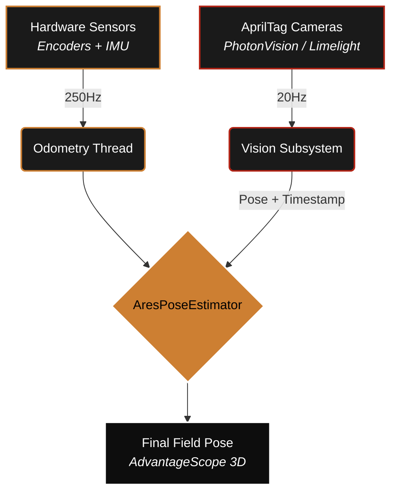

import { Aside } from '@astrojs/starlight/components';

Odometry is fast but drifts over time. Vision is global but slow and noisy. **Vision Fusion** is the process of combining both to achieve a "source of truth" pose that is both high-frequency and drift-free. ARESLib uses a latency-compensating rollback algorithm to ensure bit-perfect accuracy.

## <span class="ares-num">01</span> The Fusion Pipeline

Fusion happens in three distinct layers to ensure reliability under competition stress:



---

## <span class="ares-num">02</span> MegaTag 2.0 & Pose Seeding

Traditional vision pose estimation (PnP) creates large "jumps" when tags are at awkward angles. ARESLib supports **MegaTag 2.0**, which uses the robot's IMU heading to seed the vision solve.

<Aside title="6-DOF Localization">
By using the IMU to define the "Down" vector, the vision system only needs to solve for 2D translation and 1D rotation. This significantly reduces "pose ambiguity" and prevents the robot from teleporting into the floor or ceiling in the 3D visualizer.
</Aside>

---

## <span class="ares-num">03</span> Lag Compensation (Rollback)

Vision measurements are always "old" (e.g., 50ms ago) by the time the code receives them. The `VisionFusionHelper` handles this by:

### <span class="ares-num">3.1</span> Maintaining Buffers
Maintaining a timestamped buffer of all previous odometry poses.

### <span class="ares-num">3.2</span> Replaying Movement
When a vision sample arrives, "rolling back" to that exact timestamp, computing correction, and "replaying" all movement forward.

```java
// VisionFusionHelper.java snippet
public static Pose2d applyVisionMeasurement(...) {
    Pose2d sample = poseBuffer.getSample(timestampSeconds);
    if (sample == null) return currentEstimate;

    // Compute correction AT the measurement timestamp
    double kX = 1.0 / (1.0 + visionStdDevs[0]);
    double kY = 1.0 / (1.0 + visionStdDevs[1]);
    
    Pose2d correctedRetroPose = new Pose2d(
        sample.getX() + xError * kX,
        sample.getY() + yError * kY,
        ...
    );

    // Replay movement forward to 'Now'
    Twist2d replayTwist = sample.log(currentEstimate);
    return correctedRetroPose.exp(replayTwist);
}
```

---

## <span class="ares-num">04</span> Tuning Trust (StdDevs)

You can tell the estimator how much to "trust" a vision measurement by adjusting the Standard Deviations. Large values = less trust; small values = strong correction.

<Aside type="info" title="Dynamic Trust">
ARESLib automatically scales trust based on distance. If a tag is 5 meters away, we increase the StdDev (trust it less). If the robot is moving at 4 m/s, we increase it further to prevent motion blur artifacts from corrupting the pose.
</Aside>
